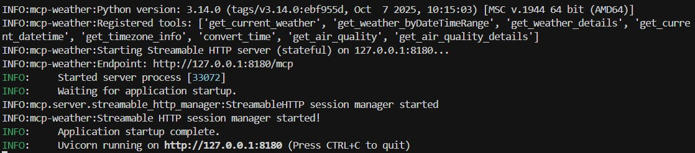
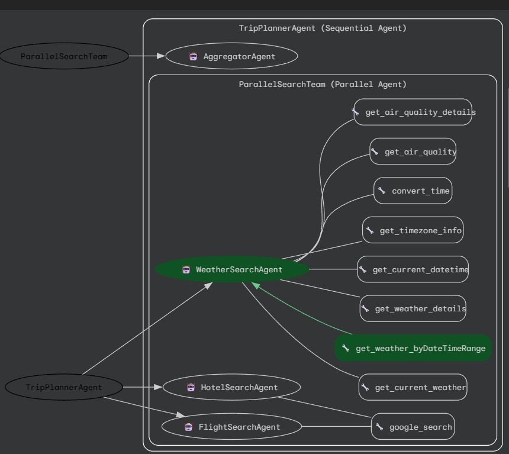

# travel_planner_ai_agent
 Travel planner AI agent built using Google ADK

### Problem Statement

Planning trip manually is laborious because it requires significant time in looking up flight itineraries, hotel booking, weather in the destination, and etc

Automation can streamline findings and recommend a trip plan.  This saves the time for the user to plan the trip.

### Solution Statement

Agents can automatically search flight itineraries, hotel booking, weather in the destination, and etc.  It helps a user to plan the trip much more efficiently.  It generate a recommended trip plan giving the user an idea the estimated cost for a cheap, a convenient, and luxary options.

### Value Statement

The travel planner agent reduced my time per trip planning, suggesting options for cheap, convenient, and luxary trip, and thus, help me to plan a trip much more efficiently.

### Enhancement
Due to the limitation of the agent, links to book the flights, hotels, and etc cannot be generated.  MCP could be a potiental solution.  However, it make the configuration for complicated since API_KEY will need to be configured for the connection. 

## Installation

### Setup the Google_API_KEY

1. Get your API key

If you don't have one already, create an API key using [Google AI Studio](https://aistudio.google.com/app/api-keys)

2. Use it to setup the environment variable GOOGLE_API_KEY

### Setup the weather mcp server

1. Install the weather MCP server locally

```bash
pip install mcp_weather_server
```

2. Run it in HTTP mode locally:

```bash
python -m mcp_weather_server --mode streamable-http --host 127.0.0.1 --port 8180

```

3. Double check the MCP server console output.  You should see info log messages similar to:





### Running the Agent in ADK Web mode

From the command line of the working directory execute the following command. 

```bash
adk web
```

### Running the Agent in script mode

From the command line of the working directory execute the following command. 


```bash
python .\travel_planner_agent\agent.py
```
Since LoggingPlugin is configured, you will see execution trace in the stdout.  In addition, a logger.log is also created to capture events.


### Features demonstrated in this agent

- Multi-agent system, including any combination of:
		Agent powered by an LLM
		Parallel agents
		Sequential agents

- Tools:
		built-in tools using Google Search

- Session Management:
  		Agent remembers user's conversations

- Observability: Logging, Tracing, Metrics

### Agent Architecture



- FlightSearchAgent - LLM Agent uses google search tool to provide flight itineraries
- HotelSearchAgent - LLM Agent uses google search tool to provide hotel booking recommendations
- ParallelSearchTeam - create a search team and delegate the search task to the corresponding agents to perform the task in parallel
- AggregatorAgent - Summarize the recommendations from the above agents
- TripPlannerAgent - a root agent works a high-level orchestrator to delegate the user request to the above agents 
