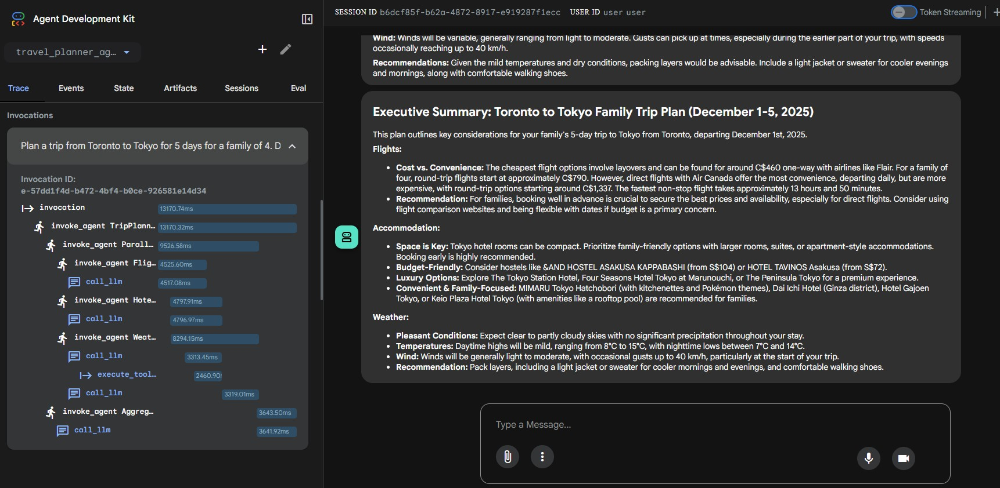

# travel_planner_ai_agent
 Travel planner AI agent built using Google ADK

### Problem Statement

Planning trip manually is laborious because it requires significant time in looking up flight itineraries, hotel booking, weather in the destination, and etc using different websites.


### Solution Statement

Agents are an excellent solution for trip planning because the task is naturally multi-step, multi-domain, and context-dependent—exactly the kind of problem agents are designed to solve.

It can automatically search flight itineraries, hotel booking, weather in the destination, and etc.  It helps a user to plan the trip much more efficiently.  It generates a recommended trip plan giving the user an idea the estimated cost for a cheap, a convenient, and luxary options.

It also summarizes the plan and provide friendly reminders to the user.

### Value Statement

The travel planner agent reduced my time per trip planning, suggesting options for cheap, convenient, and luxary trip, and thus, help me to plan a trip much more efficiently.

## Installation

### Setup the Google_API_KEY

1. Get your API key

If you don't have one already, create an API key using [Google AI Studio](https://aistudio.google.com/app/api-keys)

2. Use it to setup the environment variable GOOGLE_API_KEY

### Setup the weather mcp server

1. Install the weather MCP server locally

```bash
pip install mcp_weather_server
```

2. Run it in HTTP mode locally:

```bash
python -m mcp_weather_server --mode streamable-http --host 127.0.0.1 --port 8180

```

3. Double check the MCP server console output.  You should see info log messages similar to:


### Running the Agent in ADK Web mode

From the command line of the working directory execute the following command. 

```bash
adk web
```

The tool provides a detail execution trace and the events happened.  Here is a sample trace:




### Running the Agent in script mode

From the command line of the working directory execute the following command. 


```bash
python -m tests.test_agent
```
Since LoggingPlugin is configured, you will see execution trace in the stdout.  In addition, a log file:logger.log is created in the root directory to capture all the details.


### Features demonstrated in this agent

- Multi-agent system, including any combination of:
		Agent powered by an LLM
		Parallel agents
		Sequential agents

- Tools:
		built-in tools using Google Search
		MCP Server for weather info lookup

- Session Management:
  		Agent remembers user's conversations

- Observability: Logging (using LoggingPlugin and the log file), Tracing (through adk web), Metrics (through adk web))

### Agent Architecture


- FlightSearchAgent - A LLM Agent uses google search tool to provide flight itineraries
- HotelSearchAgent - A LLM Agent uses google search tool to provide hotel booking recommendations
- WeatherSearchAgent - A LLM Agent use MCP server to provide weather summary for the trip.
- ParallelSearchTeam - A search team comprised of the above agents.  It delegates a particular task to the corresponding agents to perform it in parallel.
- AggregatorAgent - Summarize the recommendations from the above agents
- TripPlannerAgent - A root agent works a high-level orchestrator to delegate the user request to the above agents 


### TO-DO

1. Create test cases and evaluation  
2. Create user interface using grido
3. Create docker compose to deploy agent and the MCP server together locally
4. Deploy application to the cloud